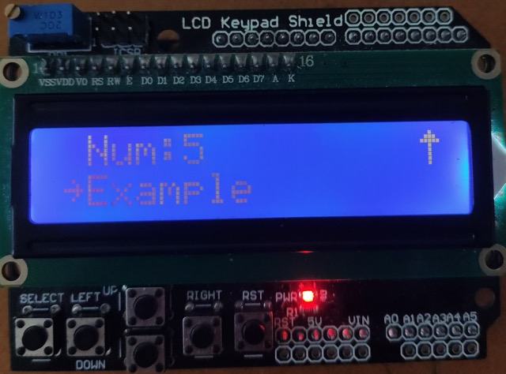
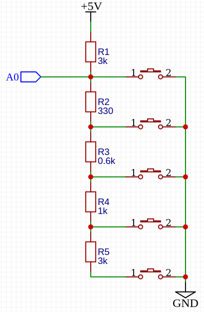

Analog Button Adapter
--------------

The button adapter is a simple input adapter that maps physical buttons connected to analog pins to menu controls.

     
Example schemtic that is used in this `LCD Keypad Shield <https://www.keyestudio.com/products/keyestudio-1602lcd-keypad-shield-for-arduino-lcd-display-atmega2560-for-raspberry-pi-uno-blue-screen-blacklight-module>`_

     

     
To use the analog button adapter, you need to include the necessary header:

.. code-block:: cpp

    #include <input/AnalogButtonAdapter.h>

Next, you need to create a AnalogButtonAdapter object and pass the analog Pin, value of valid press, otional margin (default: 20) and the menu object:

.. tab-set::
    .. tab-item:: With default margin

         .. code-block:: cpp

            AnalogButtonAdapter ButtonBackSpace(&menu, A0, 20, BACKSPACE);
            AnalogButtonAdapter ButtonUp(&menu, A0, 100, UP);
            AnalogButtonAdapter ButtonDown(&menu, A0, 250, DOWN);
            AnalogButtonAdapter ButtonBack(&menu, A0, 400, BACK);
            AnalogButtonAdapter ButtonEnter(&menu, A0, 640, ENTER);

    .. tab-item:: With custom margin
    
         .. code-block:: cpp

            AnalogButtonAdapter ButtonBackSpace(&menu, A0, 20, 50, BACKSPACE);
            AnalogButtonAdapter ButtonUp(&menu, A0, 100, 50, UP);
            AnalogButtonAdapter ButtonDown(&menu, A0, 250, 50, DOWN);
            AnalogButtonAdapter ButtonBack(&menu, A0, 400, 50, BACK);
            AnalogButtonAdapter ButtonEnter(&menu, A0, 640, 50, ENTER);

Finally, you need to observe the AnalogButtonAdapter object in the loop function:

.. code-block:: cpp

    void loop() {
          ButtonBackSpace.observe();
          ButtonUp.observe();
          ButtonDown.observe();
          ButtonBack.observe();
          ButtonEnter.observe();
    }

The AnalogButtonAdapter will take care of translating the physical button presses into menu controls, allowing you to navigate through the menu system with ease.

For more information about the AnalogButtonAdapter, check the :cpp:class:`API reference <AnalogButtonAdapter>`.
