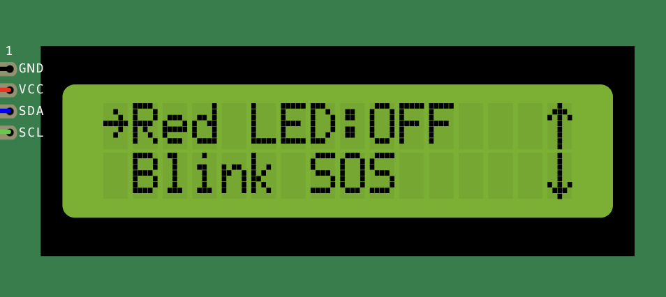

Command Menu Item
-----------------

The command menu item is a menu item that executes a function when selected by the user.
It is useful for creating menu items that perform a specific action when selected.

This can be used in various scenarios, such as:

- Controlling a device or sensor (e.g., turning on a motor)
- Changing a setting or configuration (e.g. saving a setting/value)
- Triggering an event or action (e.g., sending a message)

There are two variants of the command menu item:

Basic command menu item
~~~~~~~~~~~~~~~~~~~~~~~~

The basic command menu item is a simple menu item that executes a lambda function when selected.

A command menu item can be created using the following syntax:

.. tab-set::

    .. tab-item:: As a lambda function

        .. code-block:: cpp

            ITEM_COMMAND("Item 1",  {
                // Function body
            })

    .. tab-item:: As a function pointer

        .. code-block:: cpp

            // Function definition
            void myFunction() {
                // Function body
            }
            // Create a command menu item
            ITEM_COMMAND("Item 1", myFunction)

Example
+++++++

Let's take a look at an example of a command menu item that simply prints a message to the serial monitor when selected:

.. code-block:: cpp

    ITEM_COMMAND("Print Message",  {
        Serial.println("Hello, world!");
    })

When the "Print Message" menu item is selected, the message "Hello, world!" will be printed to the serial monitor.

.. code-block:: console

    $ Hello, world!

Another example of a command menu item is the ``ITEM_BACK``, which is used to navigate back to the previous menu screen.
This is useful when you don't have a dedicated "Back" input button on your setup.

.. code-block:: cpp

    // You caan also pass a custom text for the back item
    ITEM_BACK()

When the "Back" menu item is selected, the menu will navigate back to the previous screen.

Find more information about the command menu item :doc:`here </reference/api/ItemCommand>` and the back menu item :doc:`here </reference/api/ItemBack>`.

Toggle command menu item
~~~~~~~~~~~~~~~~~~~~~~~~

The toggle command menu item is a menu item that toggles between two states when selected by the user.

A toggle command menu item can be created using the following syntax:

.. code-block:: cpp

    // The initial state of the toggle menu item is set to false
    ITEM_TOGGLE("Item 1",  {
        // Function body
    })

The toggle command menu item takes a lambda function that accepts a boolean parameter representing the current state of the item.
There are other ways to create a toggle command menu item, check the :doc:`API reference </reference/api/ItemToggle>` for more information.

Example
+++++++

Let's take a look at an example of a toggle command menu item that toggles an LED on and off when selected:

.. code-block:: cpp

    // The initial state of the toggle menu item is set to false
    ITEM_TOGGLE("Red LED",  {
        if (state) {
            digitalWrite(LED_PIN, HIGH);
        } else {
            digitalWrite(LED_PIN, LOW);
        }
    })

When the "Toggle LED" menu item is selected, the LED connected to the `LED_PIN` pin will be toggled on and off.

