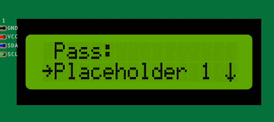

Charset input item
------------------

The charset input item is a menu item that allows the user to input a string value with a specific charset.
It extends the :doc:`input item </overview/deep-dive/input>` and adds a charset property.

The charset input can be useful in scenarios where you don't have a full keyboard/keypad available,
and you want to be able to use the ``up`` and ``down`` action to cycle through a set of characters.

It can also be used to restrict the input value to a specific set of characters.

The charset input item has the following properties:

- **label**: The label that is displayed on the screen.
- **default**: The default value that is displayed in the input field.
- **charset**: The charset that is used to restrict the input value.
- **callback**: A callback function that is called when the input is submitted.

The charset input item can be created using the following syntax:

.. code-block:: cpp

    ITEM_INPUT_CHARSET("Pass", (char*) "0123456789",  {
        // Callback function to handle input submission
        // value is the string value entered by the user
        // Do something with the input value
    })

When the ``Pass`` menu item is selected, an input field will be displayed on the screen, allowing the user to enter a string value.
The input value will be restricted to the characters specified in the charset.

You can create multiple charset input items in the same menu screen, each with its own label, default value, and charset.

For more information about the charset input item, check the :doc:`API reference </reference/api/ItemInputCharset>`.