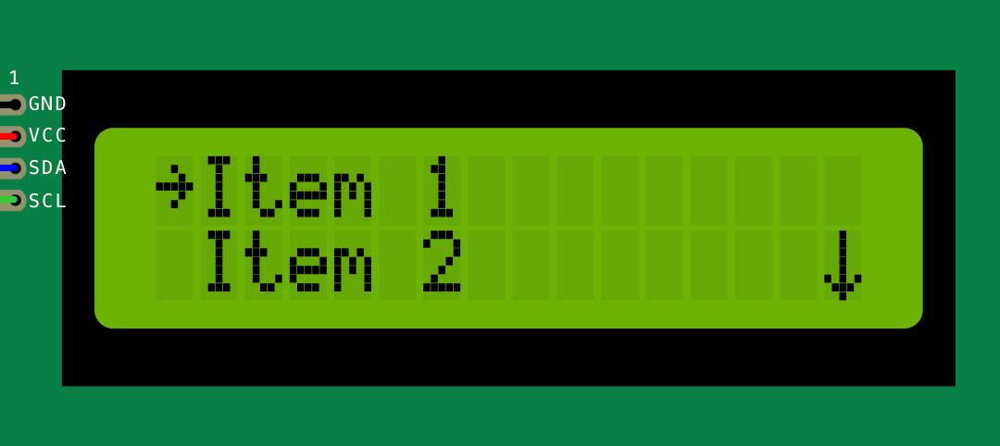

Basic menu item
---------------

The basic menu item is a simple menu item that displays a text label on the screen.
It does not have any special behavior other than being selectable by the user.
It behaves like a placeholder and has no associated action or behavior.

The basic menu item is useful for creating simple menu structures with static text labels.

A basic menu item can be created using the following syntax:

.. code-block:: cpp

    ITEM_BASIC("Item 1")

This is how a basic menu item is rendered on a 16x2 LCD screen:

Find more information about the basic menu item in the :doc:`API reference </reference/api/MenuItem>`.