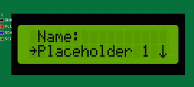

Input item
----------

The input item is a menu item that allows the user to input a string value.
The input item can be used to collect user input and store it in a variable.

The input item has the following properties:

- **label**: The label that is displayed on the screen.
- **default**: The default value that is displayed in the input field.
- **callback**: A callback function that is called when the input is submitted.

The input item can be created using the following syntax:

You can create an input item by specifying the label and the default value:

.. code-block:: cpp

    ITEM_INPUT("Name",  {
        // Callback function to handle input submission
        // value is the string value entered by the user
        // Do something with the input value
    })

When the ``Name`` menu item is selected, an input field will be displayed on the screen, allowing the user to enter a string value.

You can create multiple input items in the same menu screen, each with its own label and default value.

This item can be further extended by creating a new class which inherits from ``ItemInput``, for example you might need to:

- Validate the input value before accepting it.
- Limit the input length.
- Display a message when the input is submitted.
- etc.

.. code-block:: cpp

    class CustomInput : public ItemInput {
    public:
        CustomInput(const char* label, const char* default_value, fptrStr callback)
            : ItemInput(label, default_value, callback) {}

        void on_submit(const char* value) override {
            // Custom logic to handle input submission
            // value is the string value entered by the user
            // Do something with the input value
        }
    };

For more information about the input item, check the :doc:`API reference </reference/api/ItemInput>`.
