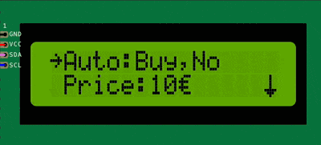
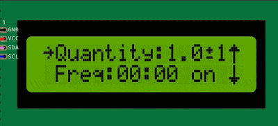
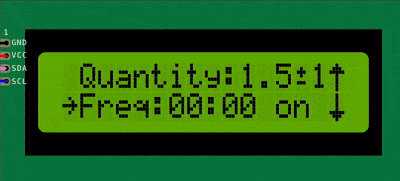
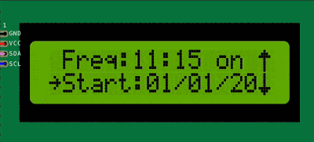

Item Widget
===========

ItemWidget is a menu item that can host widgets.
It is used to create a menu item that can display one or more widgets on the screen.

.. toctree::
    :maxdepth: 1
    :caption: The following are some of the widgets that can be added to an ItemWidget:

    ../widgets/widget-bool
    ../widgets/widget-list
    ../widgets/widget-range

ItemWidget has the following properties:

- **text**: The text to display for the menu item.
- **callback**: A callback function that will be called when the menu item is selected (default: nullptr).
- **widgets**: An array of widgets that will be displayed.

ItemWidget can host one or more widgets.
The widgets can be of different types and can be used to display different types of data.

The following are examples of how to create ItemWidget widgets.

.. code-block:: c++

    std::vector<const char*> options = { "Buy", "Sell" };

    ITEM_WIDGET(
        "Auto",
         { Serial.println(option); Serial.println(isAuto); },
        WIDGET_LIST(options, 0, "%s", 0, true),
        WIDGET_BOOL(false, "Yes", "No", ",%s")),

Note: The callback receives the index of the selected option (0-based), not the actual string value. 

In the above example, the ItemWidget allows the user to select an option from "Buy" or "Sell" and also toggle between "Yes" and "No".
The user is able to select if the option (Buy or Sell) is carried out automatically or not. 

.. code-block:: c++

    // \002 is used to display the plus or minus sign (±) because the glyph was saved in slot 2 of the display.

    ITEM_WIDGET(
        "Quantity",
         { Serial.println(quantity); Serial.println(tolerance); },
        WIDGET_RANGE(1.0f, 0.1f, 0.1f, 100.0f, "%.1f", 0),
        WIDGET_RANGE(10, 1, 0, 100, "\002%d%%", 1)),

In the above example, the ItemWidget allows the user to select a quantity between 1.0 and 100.0 in steps of 0.1 and also select a tolerance between 0 and 100 in steps of 1.
The selected quantity will be displayed as **"1.0±10%"**, **"1.1±14%"**, **"1.2±17%"**, etc.
The user is able to select the quantity and tolerance for a particular trade.

.. code-block:: c++

    std::vector<const char*> days = { "Mon", "Tue", "Wed", "Thu", "Fri", "Sat", "Sun" };

    ITEM_WIDGET(
        "Freq",
         { Serial.println(hour); Serial.println(minute); Serial.println(day); },
        WIDGET_RANGE(0, 1, 0, 23, "%02d", 0, false),
        WIDGET_RANGE(0, 1, 0, 59, ":%02d", 0, false),
        WIDGET_LIST(days, 0, " on %s", 0, true)),

Note: The callback receives the index of the selected option (0-based), not the actual string value. 

In the above example, the ItemWidget allows the user to select a frequency for a particular task.
The user is able to select the hour, minute, and day of the week for the task.
The selected frequency will be displayed as **"00:00 on Mon"**, **"00:01 on Tue"**, **"00:02 on Wed"**, etc.

.. code-block:: c++

    ITEM_WIDGET(
        "Start",
         { Serial.println(day); Serial.println(month); Serial.println(year); },
        WIDGET_RANGE(1, 1, 1, 31, "%02d", 0, true),
        WIDGET_RANGE(1, 1, 1, 12, "/%02d", 0, true),
        WIDGET_RANGE(2021, 1, 2020, 2050, "/%04d", 0, true)),

In the above example, the ItemWidget allows the user to select a start date for a particular task.
The user is able to select the day, month, and year for the task.
The selected date will be displayed as **"01/01/2021"**, **"01/02/2021"**, **"01/03/2021"**, etc.

.. code-block:: c++

    std::vector<char> pinChars = {'1', '2', '3', '4', '5', '6', '7', '8', '9', 'A', 'B', 'C', 'D', 'E', 'F'};

    ITEM_WIDGET(
        "Pin",
         { Serial.print(d1); Serial.print(d2); Serial.print(d3); Serial.println(d4); },
        WIDGET_LIST(pinChars, 2, "%c", 0, true),
        WIDGET_LIST(pinChars, 6, "%c", 0, true),
        WIDGET_LIST(pinChars, 10, "%c", 0, true),
        WIDGET_LIST(pinChars, 14, "%c", 0, true))

Note: The callback receives the index of the selected option (0-based), not the actual string value. 

In the above example, the ItemWidget allows the user to select a 4-digit pin.
The user is able to select each digit of the pin from the list of characters "123456789ABCDEF".
The selected pin will be displayed as **"1234"**, **"5678"**, **"9ABC"**, etc.

For more information about the widget item, check the :cpp:class:`API reference <ItemWidget>` or this :doc:`example </reference/samples/Widgets>`.
