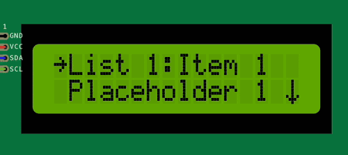

List menu item
--------------

.. deprecated:: 5.4.0

   Please use :doc:`widget item </overview/items/item-widget>` instead.

The list menu item is a menu item that displays a list of string items on the screen.
It is used to present a list of options to the user, allowing them to select one of the items.

This can be useful for creating a menu item that presents a list of options to the user, such as
a list of colors, fonts, or other settings.

A list menu item can be created using the following syntax:

You first need to define the list of string items that will be displayed in the list:

.. code-block:: cpp

    String listItems[] = {
        "Item 1",
        "Item 2",
        "Item 3",
        "Item 4"
    };

Then you can create a list menu item entry in the menu screen while precising a callback function
that will be called when an item is selected:

.. code-block:: cpp

    // ... More menu items
    ITEM_LIST("List 1", listItems, 4,  {
        // Callback function to handle item selection
        // index is the index of the selected item in the list
        // Do something with the selected item
    })
    // ... More menu items

When the ``List 1`` menu item is selected, the list of items will be displayed on the screen, allowing the user to select one of the items.

You can create multiple list menu items in the same menu screen, each with its own list of items.

Find more information about the list menu item in the :cpp:class:`API reference <ItemList>`.
