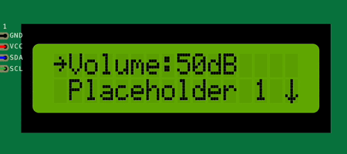
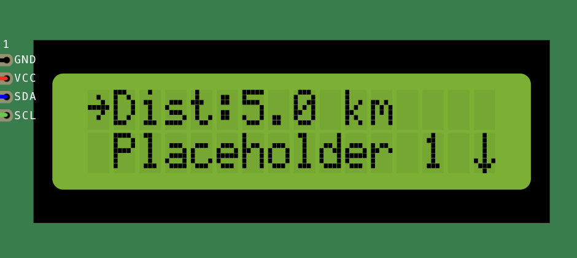

Range item
----------

The range item is a menu item that allows the user to select a value within a specified range.
It is used to create a menu item that presents a range of values to the user, such as a brightness level or a volume setting.

This can be useful for creating a menu item that allows the user to adjust a setting within a specific range of values.

There are two types of range items: integer range and float range.

Integer range
~~~~~~~~~~~~~

An integer range item can be created using the following syntax:

.. code-block:: cpp

    // ... More menu items
    ITEM_INT_RANGE("Brightness", 0, 100, 50,  {
        // Callback function to handle value change
        // value is the selected value within the range
        // Do something with the selected value
    })
    // ... More menu items

- The first argument is the name of the range item.
- The second argument is the minimum value of the range.
- The third argument is the maximum value of the range.
- The fourth argument is the initial value of the range.
- The last argument is a callback function that will be called when the value is changed.

When the ``Brightness`` menu item is selected, the user can adjust the brightness level within the range of 0 to 100.

You can also optionally specify a unit string to be displayed next to the value:

.. code-block:: cpp

    // ... More menu items
    ITEM_INT_RANGE("Volume", 0, 100, 50,  {
        // Callback function to handle value change
        // value is the selected value within the range
        // Do something with the selected value
    }, (const char*) "dB"),
    // ... More menu items

When the ``Volume`` menu item is selected, the user can adjust the volume level within the range of 0 to 100, with the unit string **"dB"** displayed next to the value.

Find more information about the range menu item in the :doc:`API reference </reference/api/ItemIntRange>`.

Float range
~~~~~~~~~~~

A float range item can be created using the following syntax:

.. code-block:: cpp

    // ... More menu items
    ITEM_FLOAT_RANGE("Dist", 0.0f, 100.0f, 5.0f,  {
        // Callback function to handle value change
        // value is the selected value within the range
        // Do something with the selected value
    }, (const char*) " km", 0.5f),
    // ... More menu items

- The last argument is the step size of the range (the increment or decrement value when changing the value).
  This argument also determines the number of decimal places to display.
  For example, a step size of ``0.5`` will display values with one decimal place,
  while a step size of ``0.01`` will display values with two decimal places.

When the ``Dist`` menu item is selected, the user can adjust the pressure within the range of 0.0 to 100.0, with the unit string **"km"** displayed next to the value.

.. hint::

    These item types support two ways of committing the value change:
    Committing the value after every change executing the callback function or only when the user exits the item.

    The default behavior is to commit the value only when the user exits the item.
    Check the API reference for more information on how to configure this behavior.

Find more information about the range menu item in the :doc:`API reference </reference/api/ItemFloatRange>`.