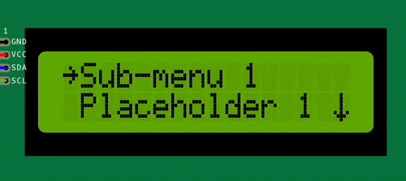

Sub-menu item
-------------

The sub-menu item is a menu item that opens a new menu screen when selected.
It is used to create a hierarchical menu structure with multiple levels of navigation.

This can be useful for organizing menu items into categories or sub-menus, making it easier for users to navigate through the menu system.

A sub-menu item can be created using the following syntax:

You first need to define the sub-menu screen with the desired menu items:

.. code-block:: cpp

    MENU_SCREEN(subMenuScreen, subMenuItems,
        ITEM_BASIC("Sub-item 1"),
        ITEM_BASIC("Sub-item 2"),
        ITEM_BASIC("Sub-item 3"),
        ITEM_BASIC("Sub-item 4"));

Then you can create a sub-menu item entry that links to the sub-menu screen in the parent menu:

.. code-block:: cpp

    // ... More menu items
    ITEM_SUBMENU("Sub-menu 1", subMenuScreen)
    // ... More menu items

When the ``Sub-menu 1`` menu item is selected, the sub-menu screen will be displayed, showing the list of sub-items.

You can create multiple levels of sub-menus by nesting sub-menu items within other sub-menu screens.

Find more information about the sub-menu item in the :cpp:class:`API reference <ItemSubMenu>`.