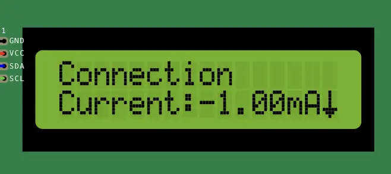
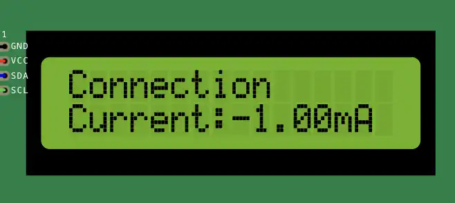

Character display renderer
==========================

The character display renderer is a simple renderer that displays the menu items on a character display.
It is a good choice if you are using a character display with your project.

The renderer supports the following features:

- Displaying menu items on a character display
- Truncating long menu items
- Highlighting the selected menu item
- Customizing the cursor character
- Customizing the up and down arrow characters
- Disabling the cursor and/arrows arrows

The renderer is easy to use and provides a number of options for customizing the display.

How to use the character display renderer
-----------------------------------------

To use the character display renderer, you need to create an instance of the ``CharacterDisplayRenderer`` class and pass it
to the ``LcdMenu`` class when you create it. Here is an example:

.. tab-set::
    :sync-group: display

    .. tab-item:: Liquid Crystal I2C
         :sync: lcd_i2c

         .. code-block:: cpp

            #include <LcdMenu.h>
            #include <LiquidCrystal_I2C.h>
            #include <display/LiquidCrystal_I2CAdapter.h>
            #include <renderer/CharacterDisplayRenderer.h>

            LiquidCrystal_I2C lcd(0x27, LCD_COLS, LCD_ROWS);
            LiquidCrystal_I2CAdapter lcdAdater(&lcd);
            CharacterDisplayRenderer renderer(&lcdAdater, LCD_COLS, LCD_ROWS);
            LcdMenu menu(renderer);

    .. tab-item:: Liquid Crystal
         :sync: lcd

         .. code-block:: cpp

            #include <LcdMenu.h>
            #include <LiquidCrystal.h>
            #include <display/LiquidCrystalAdapter.h>
            #include <renderer/CharacterDisplayRenderer.h>

            LiquidCrystal lcd(12, 11, 5, 4, 3, 2);
            LiquidCrystalAdapter lcdAdapter(&lcd, LCD_COLS, LCD_ROWS);
            CharacterDisplayRenderer renderer(&lcdAdapter, LCD_COLS, LCD_ROWS);
            LcdMenu menu(renderer);

Don't forget to replace ``LCD_COLS`` and ``LCD_ROWS`` with the number of columns and rows on your display.

After you have created the renderer, you then have to call the ``begin()`` method on the renderer to initialize it.

.. code-block:: cpp

    void setup() {
        renderer.begin();
    }

Customizing the character display renderer
------------------------------------------

The character display renderer provides a number of options for customizing the display. You can set the following options:

- The cursor characters (normal and editing)
- The up and down arrow characters
- Whether to display the cursor and/or arrows

Here is an example of how to customize the renderer:

Hide the arrows only
^^^^^^^^^^^^^^^^^^^^

You may want to hide the up and down arrows if you don't need them or want more space for rendering the menu items.

.. code-block:: cpp

    CharacterDisplayRenderer renderer(
        &lcdAdapter,
        LCD_COLS,
        LCD_ROWS,
        0x7E,  // cursorChar
        0x7F,  // editCursorChar
        NULL,  // upArrow
        NULL   // downArrow
    );

Hide the cursor only
^^^^^^^^^^^^^^^^^^^^

.. code-block:: cpp

    CharacterDisplayRenderer renderer(
        &lcdAdapter,
        LCD_COLS,
        LCD_ROWS,
        0,  // cursorChar
        0   // editCursorChar
    );

Hide both the cursor and arrows
^^^^^^^^^^^^^^^^^^^^^^^^^^^^^^^

.. code-block:: cpp

    CharacterDisplayRenderer renderer(
        &lcdAdapter,
        LCD_COLS,
        LCD_ROWS,
        0,  // cursorChar
        0,  // editCursorChar
        NULL,  // upArrow
        NULL   // downArrow
    );

If these options are not enough for you, you can always create your own custom renderer by subclassing the ``CharacterDisplayRenderer`` class.

Find more information about the character display renderer in the :doc:`API reference </reference/api/renderer/CharacterDisplayRenderer>`.